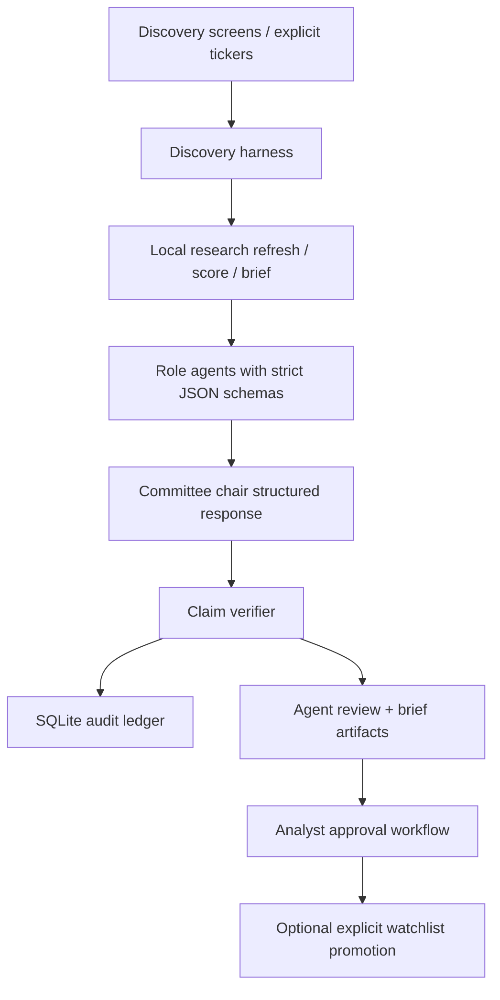

# Institutional AI Agent Harness

The AI agent harness is an institutional-pilot orchestration layer for stock discovery and research. It is not a trading system. It automates attention, evidence review, and audit trails while the deterministic investor toolkit remains the source of truth for data refreshes, metrics, valuations, and portfolio signals.

The authority boundary is strict:

- Deterministic toolkit: refreshes research, normalizes filings/metrics/prices, validates assumptions, runs valuations, and builds portfolio signals.
- Discovery harness: owns candidate queue state, component scores, source facts, run logs, rejection/defer records, and deterministic promotion proposals.
- AI agent harness: runs role-specific LLM agents over persisted evidence and writes structured reviews, briefs, claim checks, token usage, and `agentSuggestedState`.
- Analyst workflow: records `analyst_approved`, `analyst_rejected`, or `needs_more_evidence`. Agents do not silently mutate holdings or watchlist entries.

## One-Command Run

Online refresh plus AI research:

```powershell
$env:SEC_USER_AGENT = "InvestorResearchAssistant contact@example.com"
$env:OPENAI_API_KEY = "..."
investor agents run --provider openai --refresh-research --limit 5
```

Explicit tickers:

```powershell
investor agents run --provider openai --ticker MSFT --ticker PANW --refresh-research --limit 2
```

No-token dry run:

```powershell
investor agents run --provider dry-run --ticker MSFT --no-default-screens
```

Dry run exercises the artifact workflow with deterministic mock responses and does not call an LLM provider.

## Architecture



Every agent response is schema-validated. Invalid schema, missing citations, unsupported claims, stale deterministic data, failed refreshes, or invalid assumptions block promotion use and produce warnings rather than a usable recommendation.

## Agent Roles

Each candidate is reviewed by four role agents:

- `business_quality`: business clarity, quality, moat clues, growth runway, and quality-vs-cheapness.
- `valuation_skeptic`: valuation evidence, valuation gaps, stale assumptions, and cheapness discipline.
- `risk_bear_case`: downside risks, missing evidence, and reasons to reject or defer.
- `portfolio_fit`: circle-of-competence fit, duplication, profile alignment, and exclusion flags.

The `committee_chair` returns one proposed state:

```text
research_more, defer, reject, promote_candidate
```

This is stored as `agentSuggestedState`. The deprecated `--apply-agent-states` flag is ignored in the institutional harness; analyst approval owns actual approval states.

## Outputs

```text
portfolio/audit.db
portfolio/agent_runs/<RUN_ID>.json
portfolio/agent_reviews/<TICKER>.json
portfolio/agent_briefs/<TICKER>.md
portfolio/approvals/<TICKER>.<TIMESTAMP>.json
portfolio/candidates.json
```

The SQLite audit ledger is append-only at the table level and stores:

```text
runs, agent_calls, tool_calls, candidate_events, claim_checks, approvals, eval_runs
```

Each audit table includes a hash chain (`sequence`, `previous_hash`, `row_hash`) plus append-only triggers. Verify integrity with:

```powershell
investor audit verify
investor audit verify --path portfolio/audit.db
```

Run logs and review artifacts include generated timestamps, provider/model, prompt version, token usage, config and artifact references, warnings, and source paths or MCP-style URIs.

## Claim Verification

Verify persisted review claims:

```powershell
investor agents verify-claims MSFT
```

The verifier checks:

- Numeric claims against the cited source/URI and named metric. A value appearing elsewhere in the candidate packet is not enough.
- Factual claims for citations.
- Deterministic warnings such as stale prices, missing filings, failed refreshes, and invalid assumptions.

Promotion proposals require clean claim verification. Unsupported claims or stale deterministic data force `suggestedState` back to `research_more`.

## Analyst Approval

Record analyst review without mutating holdings or watchlist:

```powershell
investor agents approve MSFT --state analyst_approved --reason "Ready for explicit watchlist-promotion review."
investor agents approve MSFT --state analyst_rejected --reason "Outside circle of competence."
investor agents approve MSFT --state needs_more_evidence --reason "Need fresh valuation and latest 10-K risk review."
```

`analyst_approved` requires an existing agent review, existing agent brief, and clean embedded `claimVerification.unsupportedCount == 0`. Approval writes `portfolio/approvals/<TICKER>.<TIMESTAMP>.json`, updates candidate approval fields, stores source hashes for the candidate/review/brief/verification, and records audit rows.

Watchlist mutation remains a separate explicit action:

```powershell
investor discovery promote MSFT --approved
```

Promotion requires current `analyst_approved` state, a current approval artifact, clean claim verification, and matching approval source hashes. Stale approval artifacts block promotion.

## Vendor Drops

Vendor integrations are normalized file imports in v1. Import CSV or Parquet drops through explicit contracts:

```powershell
investor data import --kind fundamentals --path vendor.csv --provider ExampleVendor
```

Supported kinds:

```text
company_master, prices, fundamentals, estimates, multiples, ownership, sector_taxonomy
```

Imports validate required columns, provider provenance, duplicate primary keys, strict dates, periods, numeric fields, allowed currencies, allowed units, price adjustment basis, restatement flags, source hash, and write manifests under `data_imports/<PROVIDER>/`.

Price imports require `ticker,date,close,currency,adjustment,provider`. Fundamentals and estimates require `ticker,period,metric,value|estimate,currency,unit,provider`.

For price freshness checks:

```powershell
investor data import --kind prices --path prices.csv --provider ExampleVendor --max-price-age-days 5
investor data import --kind prices --path prices.csv --provider ExampleVendor --max-price-age-days 5 --block-stale-prices
```

## Evals

Run a local analyst-labeled gold set:

```powershell
investor eval run --suite gold_candidates
```

Gold sets live at `evals/<SUITE>.jsonl`. Results are written to `evals/results/<RUN_ID>.json` and recorded in `portfolio/audit.db`.

Tracked metrics:

- schema-valid rate
- unsupported-claim rate
- unsupported numeric claims per case
- citation coverage
- correct triage state
- rejected-idea resurfacing rate
- analyst acceptance rate

The eval gate fails when any row fails, required evidence is missing, schema-valid rate is below 100%, unsupported numeric claims are non-zero, citation coverage is below 95%, or known rejects resurface as promotion candidates.

## Token Costs

`provider=openai` calls the OpenAI Responses API once per role agent plus once for the committee chair. The first implementation runs five LLM calls per candidate.

Token usage is persisted in:

- `portfolio/agent_runs/<RUN_ID>.json`
- `portfolio/agent_reviews/<TICKER>.json`
- `portfolio/candidates.json` under `agentTokenUsage`
- `portfolio/audit.db` under `runs` and `agent_calls`

Use `--limit`, `--ticker`, and `--max-context-chars` to control spend. Use `--provider dry-run` for no-token workflow tests.

## Model Defaults

The OpenAI provider uses the configured default in code unless overridden. You can set:

```powershell
$env:INVESTOR_AGENT_MODEL = "gpt-5.5"
investor agents run --provider openai
```

or pass it directly:

```powershell
investor agents run --provider openai --model gpt-5.5
```

## Safety Rules

- No buy/sell/hold recommendations.
- No invented financial numbers.
- Source facts, deterministic calculations, and judgment stay separate.
- Promotion means explicit user review only.
- Holdings are never mutated by discovery or agents.
- Watchlist mutation requires an explicit promotion command.
